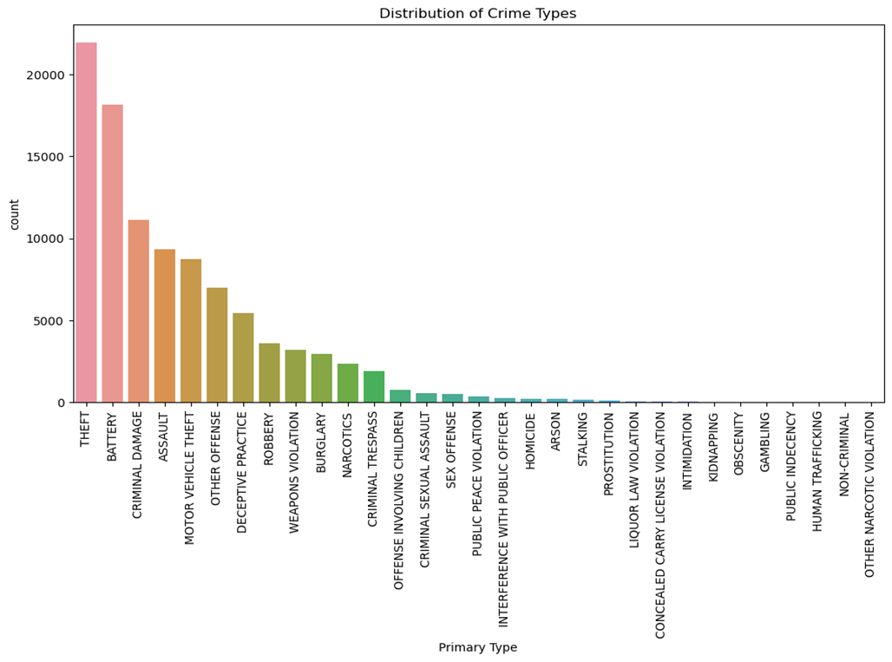
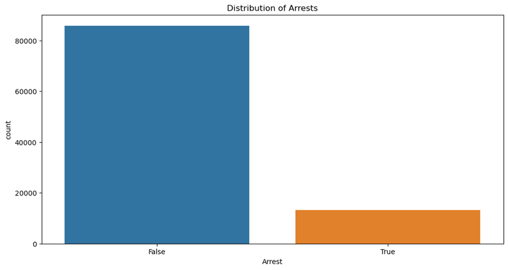
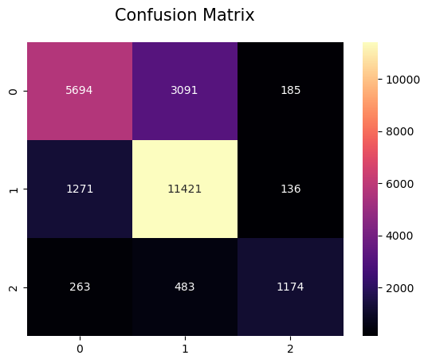

---

# Chicago Crimes Classifier

## Introduction
Welcome to the Chicago Crimes Classifier project. This README file provides an overview of the project, including the background, data understanding, exploratory data analysis, modeling process, and recommendations.

## Business Understanding
The primary objective of this project is to classify different types of crimes in Chicago. Accurate crime classification aids in better resource allocation and strategic planning for law enforcement agencies. By building a machine learning model, we aim to predict crime categories based on historical data.

## Data Understanding
The dataset used for this project consists of crime records in Chicago. The key features utilized in the analysis include:
- Date and time of the crime
- Location description
- Type of crime
- Arrest made or not
- Domestic crime or not
- Beat, district, ward, community area, etc.

Irrelevant or redundant features removed from the dataset include 'ID', 'Case Number', 'Block', 'IUCR', 'Description', 'FBI Code', 'X Coordinate', 'Y Coordinate', 'Updated On', 'Location', and 'Year'.

## Data Cleaning
Data cleaning steps involved:
- Removing columns with redundant information or high cardinality.
- Handling missing values by dropping rows with null values, as they were relatively few.

## Exploratory Data Analysis (EDA)
Exploratory data analysis involved:
- Visualizing the distribution of crime types.
- Visualizing effectiveness of arrests

Key Visuals:
1. **Distribution of Crime Types**
![Crime Type Distribution]

2. **Distribution of Arrests**
![Distribution of Arrests]

## Modeling
The modeling process involved testing various machine learning models, including Random Forest, Gradient Boosting, and XGBoost. The detailed hyperparameter tuning process for XGBoost was performed using RandomizedSearchCV.

### Model Performance
| Model            | Accuracy  |
|------------------|-----------|
| Random Forest    | 71.0%     |
| Gradient Boosting| 76.0%     |
| XGBoost          | 77.0%     |

The XGBoost model performed the best with an accuracy of 77% on the test set.

## Model Evaluation
The selected XGBoost model was evaluated using a classification report and a confusion matrix. Observations indicated that the model had difficulty differentiating between certain categories.

Below is the confusion matrix and classification report

                precision    recall  f1-score   support

       ODATP       0.79      0.63      0.70      8970
        ODAP       0.76      0.89      0.82     12828
      OAPHSD       0.79      0.61      0.69      1920

    accuracy                               0.77     23718
    macro avg          0.78      0.71      0.74     23718
    weighted avg       0.77      0.77      0.77     23718

## Recommendations
- Further tuning of hyperparameters could improve model performance.
- Collect more data to enhance model accuracy.
- Regularly update the model with new crime data to maintain accuracy.

## Next Steps
- Implement the classifier in the real-time crime reporting system.
- Monitor the model's performance and retrain periodically.
- Explore additional features that could improve classification accuracy, such as weather data and social events.

## Conclusion
This project has provided a reliable starting point for classifying crimes in Chicago. The XGBoost model showed promising results, but continuous evaluation and improvement are essential for maintaining its accuracy and usefulness.

---

This README file provides a comprehensive overview of the Chicago Crimes Classifier project, including all the critical aspects covered in the slides.